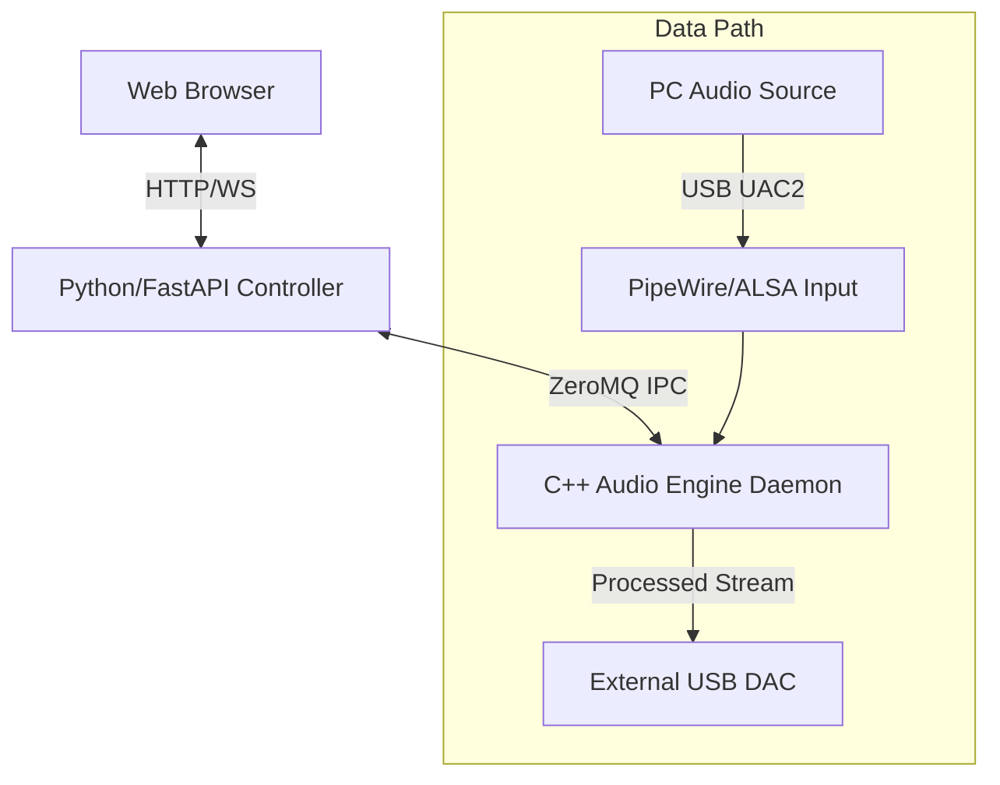

# CLAUDE.md

This file provides guidance to Claude Code (claude.ai/code) when working with code in this repository.

## Most important rule about language
Think in English and answer in Japanese.

## Project Vision & Concept

### Magic Box Project - 魔法の箱

**Vision:** 全てのヘッドホンユーザーに最高の音を届ける箱

**Ultimate Simplicity:**
1. 箱をつなぐ
2. 管理画面でポチポチ
3. 最高の音

ユーザーに余計なことを考えさせない。ヘッドホンを選んで、ボタンを押すだけ。

### Core Concept
- **Ultimate Filtering:** 2,000,000 (2M) タップの最小位相FIRフィルタによる究極のアップサンプリング
- **Headphone Correction:** ヘッドホンの周波数特性をターゲットカーブに自動補正（EQはあくまで補正用途）
- **Seamless Operation:** 入力レート自動検知、DAC性能に応じた最適アップサンプリング
- **Simple UI:** Web上でヘッドホンを選んでポチポチするだけ

### Future Goals
- リバーブ機能
- クロスフェードでのシームレスな音場切り替え

## Target Curve & EQ Source

### Target Curve: KB5000_7
最新の研究に基づくKB5000_7カーブにフィッティング

### EQ Source: oratory1990 (AutoEQ)
- oratory1990がAutoEQで公開しているヘッドホン測定データをベース
- 基本設定に追加: `Filter 11: ON PK Fc 5366 Hz Gain 2.8 dB Q 1.5`

## System Architecture

### Control Plane / Data Plane Separation



### Control Plane (Python/FastAPI)
システムの頭脳。ユーザー操作と数値計算を担当。

- **Web UI:** React/VueベースのSPA。ヘッドホン選択、EQ設定、ステータス監視
- **IR Generator:**
  - `scipy` を使用し、oratory1990データとユーザーターゲットを合成
  - 周波数特性から最小位相（Minimum Phase）IRを生成
  - **Dual Target Generation:** 係数更新時、44.1kHz系と48kHz系の2種類のIRを事前生成・保存
- **Orchestrator:** C++エンジンへのコマンド送信（係数ロード指示、ソフトリセット等）

### Data Plane (C++ Audio Engine)
システムの心臓。低遅延・高負荷処理を担当。

- **Input Interface:** `libpipewire` / `JACK` APIを使用し、入力サンプリングレート変更をイベントとして検知
- **Resampler:** `libsoxr` (Very High Quality) を使用。入力レートに関わらず、ターゲットレート（DAC限界）へ変換
- **Convolution Core (GPU):**
  - CUDA FFT (`cuFFT`) を使用したOverlap-Save法
  - Partitioned Convolutionにより、2Mタップ処理時のレイテンシを制御
- **Buffering:** `moodycamel::ReaderWriterQueue` (Lock-free) によるスレッド間データ転送
- **Output Interface:** ALSA (`alsa-lib`) 直接制御によるBit-perfect出力

## Hardware Specifications

### Development Environment (PC)
| Item | Specification |
|------|---------------|
| GPU | NVIDIA RTX 2070 Super (8GB VRAM) or better |
| CUDA Arch | SM 7.5 (Turing) |
| OS | Linux (Ubuntu 22.04+) |
| Audio | PipeWire |

### Production Environment (Magic Box)
| Item | Specification |
|------|---------------|
| SoC | NVIDIA Jetson Orin Nano Super (8GB, 1024 CUDA Cores) |
| CUDA Arch | SM 8.7 (Ampere) |
| Storage | 1TB NVMe SSD (KIOXIA EXCERIA G2) |
| Input | USB Type-C (UAC2 Device Mode) |
| Output | USB Type-A → External USB DAC |
| Network | Wi-Fi / Ethernet (Web UI access) |

## Development Roadmap

### Phase 1: Core Engine & Middleware (Current Focus)
- [x] GPU Convolution Algorithm (PC実装完了、~28x realtime)
- [ ] C++ Daemon実装（PipeWire入力、ALSA出力、libsoxr統合）
- [ ] ZeroMQ通信の実装
- [ ] 自動調停ロジック（DACネゴシエーション）の実装

### Phase 2: Control Plane & Web UI
- [ ] Python/FastAPIバックエンド構築
- [ ] oratory1990データの取得・パース処理
- [ ] 最小位相IR生成アルゴリズム（scipy）の実装
- [ ] Webフロントエンド実装

### Phase 3: Hardware Integration
- [ ] Jetson Orin Nano への移植
- [ ] Linux (Ubuntu) のUSB Gadget Mode設定
- [ ] Systemdサービス化と自動起動設定
- [ ] パフォーマンスチューニング（メモリ帯域最適化）

## Technical Specifications

### Filter Specifications
| Parameter | Value |
|-----------|-------|
| Tap Count | 2,000,000 (2M) |
| Phase Type | Minimum Phase (NO pre-ringing) |
| Window | Kaiser (β=55) |
| Stopband Attenuation | ~197dB |
| Upsampling Ratio | Up to 16x |

### Audio Processing
| Parameter | Value |
|-----------|-------|
| Input Rates | 44.1kHz / 48kHz |
| Output Rates | Up to 705.6kHz / 768kHz |
| FFT Method | Overlap-Save |
| Block Size | 4096-8192 samples |

### Auto-Negotiation Logic
1. **DAC Capability Scan:** ALSA経由でDACの最大サンプリングレートを取得
2. **Input Analysis:** 入力ストリームの系譜（44.1k vs 48k系）を判定
3. **Strategy Decision:** `Input Rate` × N が `DAC Max Rate` 以下かつ最大となる整数倍率を算出

### Safety Mechanisms
- **Soft Mute:** レート切り替え時、クロスフェード（Fade-out/in）でポップノイズ防止
- **Dynamic Fallback:** GPU負荷監視、XRUN時は自動的に軽量モードへ移行

## Key Technical Constraints

### Minimum Phase Requirement
- Linear phase filters cause pre-ringing (artifacts BEFORE transients)
- Minimum phase concentrates impulse energy at t≥0, preserving transient attack
- **Non-negotiable** for high-fidelity audio reproduction

### Stopband Attenuation (-197dB)
- Ensures aliasing components are far below quantization noise floor
- Requires large tap count + careful windowing (Kaiser β≈55)
- Coefficients normalized to DC gain = 1.0 to prevent clipping

### GPU Memory Management
- Filter coefficients loaded once at initialization
- Streaming data uses ring buffers to minimize transfer overhead
- CUDA device memory allocation should be persistent, not per-block

## Development Commands

### Filter Generation (Python/uv)
```bash
# Setup environment
uv sync

# Generate 2M-tap filter coefficients
uv run python scripts/generate_filter.py --taps 2000000 --kaiser-beta 55

# Output:
# - data/coefficients/filter_44k_2m_min_phase.bin (8 MB binary)
# - data/coefficients/filter_44k_2m_min_phase.json (metadata)
# - plots/analysis/*.png (validation plots)
```

### Build (C++/CUDA)
```bash
# PC Development (RTX 2070S, SM 7.5)
cmake -B build -DCMAKE_BUILD_TYPE=Release
cmake --build build -j$(nproc)

# Jetson Orin Nano (SM 8.7) - change CUDA_ARCHITECTURES in CMakeLists.txt
# set(CMAKE_CUDA_ARCHITECTURES 87)
```

### Run
```bash
# Start daemon
./scripts/daemon.sh start

# Status check
./scripts/daemon.sh status

# Restart with EQ profile
./scripts/daemon.sh restart data/EQ/profile.txt
```

## Directory Structure

```
gpu_os/
├── README.md              # User-facing documentation
├── CLAUDE.md              # AI development guide (this file)
├── AGENTS.md              # AI collaboration guidelines
├── CMakeLists.txt         # Build configuration
├── config.json            # Runtime configuration
├── pyproject.toml         # Python dependencies
│
├── src/                   # C++/CUDA source code
│   ├── convolution_engine.cu   # GPU core
│   ├── alsa_daemon.cpp         # ALSA output daemon
│   ├── pipewire_daemon.cpp     # PipeWire daemon
│   └── ...
│
├── include/               # C++ headers
├── scripts/               # Python tools & shell scripts
├── data/
│   ├── coefficients/      # FIR filter coefficients
│   └── EQ/                # EQ profiles
│
├── docs/
│   ├── architecture/      # System design docs
│   ├── reports/           # Phase implementation reports
│   ├── investigations/    # Investigation logs
│   ├── setup/             # Setup guides
│   └── roadmap.md         # Development roadmap
│
├── web/                   # Web UI (FastAPI)
├── plots/                 # Analysis plots
└── build/                 # Build output
```

## Git Workflow

**Always use Git Worktree for feature development and bug fixes.**

```bash
# Create a new worktree for the feature branch
git worktree add ../gpu_os_<feature-name> -b feature/<feature-name>

# Work in the worktree directory
cd ../gpu_os_<feature-name>

# After completion, push and create PR
git push -u origin feature/<feature-name>
gh pr create --title "..." --body "..."

# Clean up after PR is merged
git worktree remove ../gpu_os_<feature-name>
```

## Reference Projects

- **HQPlayer:** Commercial benchmark for target audio quality
- **VkFFT:** High-performance Vulkan FFT library (GitHub: DTolm/VkFFT)
- **CamillaDSP:** Linux FIR filter engine (CPU-based, architectural reference)
- **oratory1990:** Headphone measurement database
- **AutoEQ:** Headphone equalization project

## Project Status

Current phase: **Phase 1** (Core Engine & Middleware)

**Achieved:**
- 2M-tap minimum phase FIR filter generation (197dB stopband attenuation)
- GPU FFT convolution engine (~28x realtime on RTX 2070S)
- PipeWire→GPU→ALSA daemon (working prototype)

**In Progress:**
- ZeroMQ communication layer
- Auto-negotiation logic
