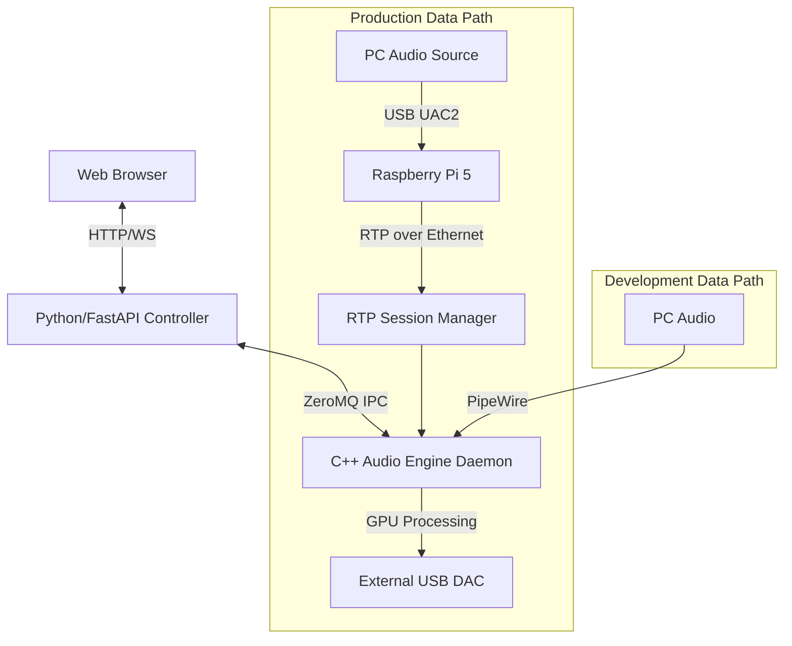

# CLAUDE.md

This file provides guidance to Claude Code (claude.ai/code) when working with code in this repository.

## Most important rule about language
Think in English and answer in Japanese.

## Project Vision & Concept

### Magic Box Project - 魔法の箱

**Vision:** 全てのヘッドホンユーザーに最高の音を届ける箱

**Ultimate Simplicity:**
1. 箱をつなぐ
2. 管理画面でポチポチ
3. 最高の音

ユーザーに余計なことを考えさせない。ヘッドホンを選んで、ボタンを押すだけ。

### Core Concept
- **Ultimate Filtering:** 640,000 (640k) タップの最小位相FIRフィルタによる究極のアップサンプリング
- **Headphone Correction:** ヘッドホンの周波数特性をターゲットカーブに自動補正（EQはあくまで補正用途）
- **Seamless Operation:** 入力レート自動検知、DAC性能に応じた最適アップサンプリング
- **Simple UI:** Web上でヘッドホンを選んでポチポチするだけ

### Future Goals
- リバーブ機能
- クロスフェードでのシームレスな音場切り替え

## Target Curve & EQ Source

### Target Curve: KB5000_7
最新の研究に基づくKB5000_7カーブにフィッティング

### EQ Source: OPRA Project (CC BY-SA 4.0)
- OPRAプロジェクト（https://github.com/opra-project/OPRA）のEQデータをベース
- **ライセンス**: CC BY-SA 4.0（商用利用OK、帰属表示必須）
- ⚠️ oratory1990データは商用利用禁止のため使用不可
- 基本設定に追加: `Filter 11: ON PK Fc 5366 Hz Gain 2.8 dB Q 1.5`

## System Architecture

### Control Plane / Data Plane Separation



### Control Plane (Python/FastAPI)
システムの頭脳。ユーザー操作と数値計算を担当。

- **Web UI:** React/VueベースのSPA。ヘッドホン選択、EQ設定、ステータス監視
- **IR Generator:**
  - `scipy` を使用し、OPRAデータとKB5000_7ターゲットを合成
  - 周波数特性から最小位相（Minimum Phase）IRを生成
  - **Dual Target Generation:** 係数更新時、44.1kHz系と48kHz系の2種類のIRを事前生成・保存
- **Orchestrator:** C++エンジンへのコマンド送信（係数ロード指示、ソフトリセット等）

### Data Plane (C++ Audio Engine)
システムの心臓。低遅延・高負荷処理を担当。

- **Input Interface (Production):**
  - RTP Session Manager: Raspberry Pi 5からのRTPストリーム受信
  - **ハイレゾ対応**: SDP自動パース → サンプルレート/ビット深度自動認識
  - **対応フォーマット**: 16/24/32-bit, 44.1k〜768kHz, ステレオ/マルチチャンネル
  - **動的追従**: RTPストリームのレート変更に自動追従（グリッチフリー切り替え）
- **Input Interface (Development):**
  - `libpipewire` APIを使用したローカルストリーム受信
- **Convolution Core (GPU):**
  - CUDA FFT (`cuFFT`) を使用したOverlap-Save法
  - Partitioned Convolutionにより、640kタップ処理時のレイテンシを制御
  - **マルチレート対応**: 全8入力レート対応（44.1k/88.2k/176.4k/352.8k/48k/96k/192k/384k）
  - 最大16倍アップサンプリング（44.1kHz → 705.6kHz, 48kHz → 768kHz）
- **Buffering:** `moodycamel::ReaderWriterQueue` (Lock-free) によるスレッド間データ転送
- **Output Interface:** ALSA (`alsa-lib`) 直接制御によるBit-perfect出力

## Hardware Specifications

### Development Environment (PoC)
| Item | Specification |
|------|---------------|
| GPU | NVIDIA RTX 2070 Super (8GB VRAM) |
| CUDA Arch | SM 7.5 (Turing) |
| OS | Linux (Ubuntu 22.04+) |
| Audio | PipeWire (ローカル開発・テスト用) |

### Production Environment (Magic Box)

**I/O分離アーキテクチャ:**
- **入力デバイス**: Raspberry Pi 5 (UAC2 + RTP送信)
- **処理デバイス**: Jetson Orin Nano Super (RTP受信 + GPU処理 + DAC出力)

#### Raspberry Pi 5 (Universal Audio Input Hub)
| Item | Specification |
|------|---------------|
| SoC | Broadcom BCM2712 (Quad-core Cortex-A76) |
| Role | ユニバーサルオーディオ入力ハブ + RTP送信 |
| Input (Primary) | USB Type-C (UAC2 Device Mode) ← PC接続 |
| Input (Network) | Spotify Connect / AirPlay 2 / Roon Bridge / UPnP/DLNA |
| Output | Ethernet → Jetson へRTP送信（ハイレゾ対応） |
| Audio Processing | PipeWire（入力ソース統合、サンプルレート変換） |
| Deployment | Docker (PipeWire + Network Audio Services + RTP Sender) |

#### Jetson Orin Nano Super (Processing Unit)
| Item | Specification |
|------|---------------|
| SoC | NVIDIA Jetson Orin Nano Super (8GB, 1024 CUDA Cores) |
| CUDA Arch | SM 8.7 (Ampere) |
| Storage | 1TB NVMe SSD (KIOXIA EXCERIA G2) |
| Input | RTP over Ethernet ← Raspberry Pi 5 |
| Output | USB Type-A → External USB DAC |
| Network | Wi-Fi / Ethernet (Web UI access) |
| Deployment | Docker (C++ Daemon + Python Web UI + CUDA Runtime) |

## Development Roadmap

### Phase 1: Core Engine & Middleware (Current Focus)
- [x] GPU Convolution Algorithm (PC実装完了、~28x realtime)
- [ ] C++ Daemon実装（PipeWire入力、ALSA出力、libsoxr統合）
- [ ] ZeroMQ通信の実装
- [ ] 自動調停ロジック（DACネゴシエーション）の実装
- [ ] **Multi-Rate Support (Critical)** - 詳細は `docs/roadmap.md` 参照
  - 48kHz系係数生成（現状44.1kHz系のみ）
  - 動的レート検知・係数切り替え
  - 88.2k/96k/192k等の入力対応

### Phase 2: Control Plane & Web UI
- [ ] Python/FastAPIバックエンド構築
- [ ] OPRAデータの取得・パース処理（CC BY-SA 4.0）
- [ ] 最小位相IR生成アルゴリズム（scipy）の実装
- [ ] Webフロントエンド実装

### Phase 3: Hardware Integration & Deployment
- [ ] Jetson Orin Nano への移植
  - CUDA Architecture変更 (SM 7.5 → SM 8.7)
  - パフォーマンス検証・チューニング
- [ ] Raspberry Pi 5 セットアップ
  - USB Gadget Mode (UAC2) 設定
  - PipeWire RTP送信機能
- [ ] Docker化
  - Jetson: C++ Daemon + Web UI + CUDA Runtime
  - Raspberry Pi 5: PipeWire + RTP Sender
  - docker-compose による統合管理
- [ ] 自動起動・監視
  - systemd によるDocker自動起動
  - ヘルスチェック機能

## Technical Specifications

### Filter Specifications
| Parameter | Value |
|-----------|-------|
| Tap Count | 640,000 (640k) |
| Phase Type | Minimum Phase (default) / Linear Phase (optional) |
| Window | Kaiser (β≈28, 32bit Float実装の量子ノイズ限界に合わせた最適値) |
| Stopband Attenuation | ~160dB (24bit品質に十分) |
| Upsampling Ratio | Up to 16x |

### Phase Type Options

システムは2種類の位相タイプをサポート：

| 位相タイプ | 特性 | レイテンシ | ユースケース |
|-----------|------|-----------|-------------|
| **Minimum Phase** (default) | プリリンギングなし、トランジェントを保持 | ゼロ（因果的フィルタ） | 音楽再生、リスニング用途 |
| **Linear Phase** | 完全に対称なインパルス応答、群遅延一定 | (N-1)/2 サンプル | ミキシング・マスタリング、位相精度が必要な用途 |

#### Minimum Phase (推奨)
- **プリリンギングなし**: インパルス応答がt≥0に集中するため、トランジェント（アタック）前にアーティファクトが発生しない
- **因果的フィルタ**: 理論的にリアルタイム処理可能
- **音楽再生に最適**: ドラムやピアノのアタック感を損なわない

#### Linear Phase
- **完全な対称性**: インパルス応答が中心で対称、群遅延が全周波数で一定
- **高レイテンシ**: 640kタップ @ 705.6kHz = 約0.45秒のレイテンシ
- **位相精度重視の用途向け**: マスタリングやミキシングなど、位相の正確性が重要な場面で使用

### Audio Processing
| Parameter | Value |
|-----------|-------|
| Input Rates | 44.1kHz / 48kHz |
| Output Rates | Up to 705.6kHz / 768kHz |
| FFT Method | Overlap-Save |
| Block Size | 4096-8192 samples |

### Auto-Negotiation Logic
1. **DAC Capability Scan:** ALSA経由でDACの最大サンプリングレートを取得
2. **Input Analysis:** 入力ストリームの系譜（44.1k vs 48k系）を判定
3. **Strategy Decision:** `Input Rate` × N が `DAC Max Rate` 以下かつ最大となる整数倍率を算出

### Safety Mechanisms
- **Soft Mute:** レート切り替え時、クロスフェード（Fade-out/in）でポップノイズ防止
- **Dynamic Fallback:** GPU負荷監視、XRUN時は自動的に軽量モードへ移行

## Key Technical Constraints

### Minimum Phase Requirement
- Linear phase filters cause pre-ringing (artifacts BEFORE transients)
- Minimum phase concentrates impulse energy at t≥0, preserving transient attack
- **Non-negotiable** for high-fidelity audio reproduction

### Stopband Attenuation (-160dB)
- Ensures aliasing components are far below quantization noise floor
- 160dB is sufficient for 24-bit audio (144dB dynamic range)
- Kaiser β≈28 provides optimal balance for 32-bit Float implementation

### DC Gain Normalization
- Zero-stuffing upsampling reduces DC by factor of L (upsample ratio)
- Filter DC gain = L compensates to maintain original signal amplitude
- Peak coefficient limited to ≤1.0 to prevent transient clipping
- Example: 16x upsampling → DC gain = 16, peak coefficient ≤ 1.0

### GPU Memory Management
- Filter coefficients loaded once at initialization
- Streaming data uses ring buffers to minimize transfer overhead
- CUDA device memory allocation should be persistent, not per-block

## Development Commands

### Filter Generation (Python/uv)
```bash
# Setup environment
uv sync

# Generate 640k-tap minimum phase filter (default β≈28)
uv run python scripts/generate_minimum_phase.py --taps 640000

# Generate 640k-tap linear phase filter
uv run python scripts/generate_linear_phase.py --taps 640000

# Generate all 8 minimum-phase configurations
uv run python scripts/generate_minimum_phase.py --generate-all

# Generate all 8 linear-phase configurations
uv run python scripts/generate_linear_phase.py --generate-all

# Output (example for minimum-phase result, 44.1kHz input, 16x upsample):
# - data/coefficients/filter_44k_16x_2m_min_phase.bin (2.44 MB binary)
# - data/coefficients/filter_44k_16x_2m_min_phase.json (metadata)
# - plots/analysis/44k_16x_* (validation plots)
```

### Build (C++/CUDA)
```bash
# PC Development (RTX 2070S, SM 7.5)
cmake -B build -DCMAKE_BUILD_TYPE=Release
cmake --build build -j$(nproc)

# Jetson Orin Nano (SM 8.7) - change CUDA_ARCHITECTURES in CMakeLists.txt
# set(CMAKE_CUDA_ARCHITECTURES 87)
```

### Run
```bash
# Start daemon
./scripts/daemon.sh start

# Status check
./scripts/daemon.sh status

# Restart with EQ profile
./scripts/daemon.sh restart data/EQ/profile.txt
```

## Directory Structure

```
gpu_os/
├── README.md              # User-facing documentation
├── CLAUDE.md              # AI development guide (this file)
├── AGENTS.md              # AI collaboration guidelines
├── CMakeLists.txt         # Build configuration
├── config.json            # Runtime configuration
├── pyproject.toml         # Python dependencies
│
├── src/                   # C++/CUDA source code
│   ├── convolution_engine.cu   # GPU core
│   ├── alsa_daemon.cpp         # ALSA output daemon
│   ├── pipewire_daemon.cpp     # PipeWire daemon
│   └── ...
│
├── include/               # C++ headers
├── scripts/               # Python tools & shell scripts
├── data/
│   ├── coefficients/      # FIR filter coefficients
│   └── EQ/                # EQ profiles
│
├── docs/
│   ├── api/               # REST API documentation
│   │   ├── openapi.json   # OpenAPI spec (auto-generated)
│   │   ├── README.md      # API overview
│   │   └── CHANGELOG.md   # API change history
│   ├── architecture/      # System design docs
│   ├── reports/           # Phase implementation reports
│   ├── investigations/    # Investigation logs
│   ├── setup/             # Setup guides
│   └── roadmap.md         # Development roadmap
│
├── web/                   # Web UI (FastAPI)
├── plots/                 # Analysis plots
└── build/                 # Build output
```

## REST API Development Guidelines

### レスポンスモデル必須

すべてのAPIエンドポイントには `response_model` を指定すること。
これにより OpenAPI スキーマが自動生成され、ドキュメントの整合性が保たれる。

```python
# Good
@router.get("/status", response_model=Status)
async def get_status():
    return Status(...)

# Bad - response_model なし
@router.get("/status")
async def get_status():
    return {"status": "ok"}
```

### エラーハンドリング統一

HTTPExceptionは以下の形式で統一する：

```python
from fastapi import HTTPException

# 標準的なエラー
raise HTTPException(status_code=404, detail="Profile not found")

# 構造化エラー（将来対応）
raise HTTPException(status_code=400, detail={"field": "name", "error": "invalid"})
```

エラーレスポンスは自動的に `ErrorResponse` 形式に変換される：
```json
{"detail": "...", "error_code": "HTTP_404"}
```

### OpenAPIドキュメント

#### タグの使用

各ルーターには適切なタグを設定：

```python
router = APIRouter(prefix="/eq", tags=["eq"])
```

#### Deprecated エンドポイント

非推奨エンドポイントは明示的にマーク：

```python
@app.post("/restart", deprecated=True, tags=["legacy"])
async def restart():
    """Deprecated: Use POST /daemon/restart instead."""
    ...
```

### OpenAPI仕様の自動生成

`web/` 配下のファイルを変更すると、pre-commit フックにより `docs/api/openapi.json` が自動更新される。

手動実行：
```bash
# OpenAPI spec を出力
uv run python scripts/export_openapi.py

# 最新かどうか確認
uv run python scripts/export_openapi.py --check
```

### API変更時のチェックリスト

- [ ] `response_model` を指定したか
- [ ] エラーケースは `HTTPException` で処理しているか
- [ ] 適切なタグを設定したか
- [ ] 破壊的変更の場合は `deprecated` を使用したか
- [ ] `docs/api/CHANGELOG.md` を更新したか

## Git Workflow

### Mandatory Rules

1. **GitHub CLI (`gh`) Required:** GitHub操作（Issue、PR、ラベル等）は必ず `gh` コマンドを使用すること
2. **Issue Number Required:** ブランチ名・PR名には必ずIssue番号を含めること
   - ブランチ名: `feature/#123-feature-name` または `fix/#456-bug-description`
   - PR名: `#123 機能の説明` または `Fix #456: バグの説明`
3. **⚠️ PRマージ禁止:** `gh pr merge` は**絶対に**ユーザーの明示的な許可なしに実行しないこと。PRの作成までは行ってよいが、マージはユーザーがレビュー後に自分で行う。
4. **⚠️ mainブランチ直接作業禁止:** mainブランチで直接コミット・編集しないこと。必ずworktreeでfeature/fix branchを作成して作業する。
5. **⚠️ `--no-verify`禁止:** `git push --no-verify`や`git commit --no-verify`は**絶対に使用しないこと**。pre-commitフックやpre-pushフックで失敗した場合は、たとえ自分の変更に起因しないエラーであっても、そのエラーを修正してからプッシュすること。テストの品質維持は全員の責任。
6. **⚠️ Skillsファイル操作もworktree必須:** `.claude/skills/`配下のファイル作成・編集時も、必ずworktreeで作業すること。mainブランチでの直接操作は厳禁。SkillsもコードであるためGit Workflowルールが適用される。

### Git Worktree

**Always use Git Worktree for feature development and bug fixes.**

```bash
# Create a new worktree for the feature branch (with Issue number)
git worktree add worktrees/123-feature-name -b feature/#123-feature-name

# Work in the worktree directory
cd worktrees/123-feature-name

# After completion, push and create PR (with Issue number in title)
git push -u origin feature/#123-feature-name
gh pr create --title "#123 機能の説明" --body "..."

# Clean up after PR is merged
git worktree remove worktrees/123-feature-name
```

### GitHub Operations (via `gh` command)

```bash
# Issue操作
gh issue list
gh issue view 123
gh issue create --title "..." --body "..."

# PR操作
gh pr create --title "#123 ..." --body "..."
gh pr list
gh pr view 123

# ラベル・マイルストーン
gh label list
gh milestone list
```

## Reference Projects

- **HQPlayer:** Commercial benchmark for target audio quality
- **VkFFT:** High-performance Vulkan FFT library (GitHub: DTolm/VkFFT)
- **CamillaDSP:** Linux FIR filter engine (CPU-based, architectural reference)
- **OPRA:** Open headphone EQ database (CC BY-SA 4.0, commercial OK)
- **AutoEQ:** Headphone equalization project (software is MIT)

## Project Status

Current phase: **Phase 1** (Core Engine & Middleware)

**Achieved:**
- 640k-tap minimum phase FIR filter generation (~160dB stopband attenuation)
- GPU FFT convolution engine (~28x realtime on RTX 2070S)
- PipeWire→GPU→ALSA daemon (working prototype)

**In Progress:**
- ZeroMQ communication layer
- Auto-negotiation logic
