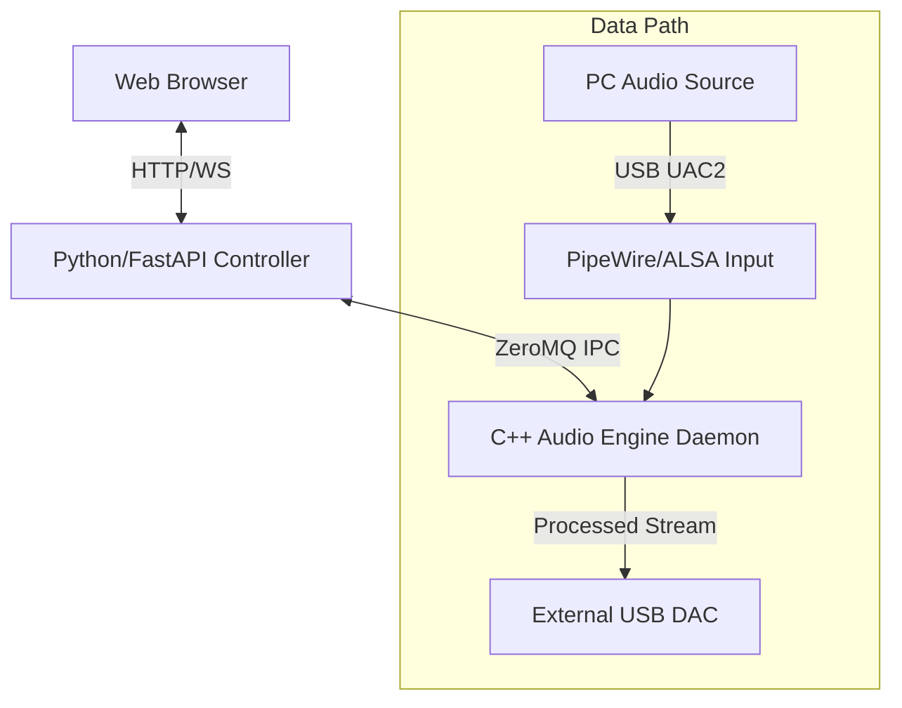

# Magic Box Project - 魔法の箱

**全てのヘッドホンユーザーに最高の音を届ける箱**

## ビジョン

**究極のシンプルさ**:
1. 箱をつなぐ
2. 管理画面でポチポチ
3. 最高の音

ユーザーに余計なことを考えさせない。ヘッドホンを選んで、ボタンを押すだけ。

## 何ができるか

- **究極のアップサンプリング**: 2,000,000タップ最小位相FIRフィルタ（197dB ストップバンド減衰）
- **ヘッドホン補正EQ**: oratory1990データベースを活用し、あなたのヘッドホンをターゲットカーブ（KB5000_7）に自動補正
- **シームレス動作**: 入力サンプルレート自動検知、DAC性能に応じた最適アップサンプリング

## アーキテクチャ



**Control Plane (Python/FastAPI)**
- Web UI: ヘッドホン選択、EQ設定、ステータス監視
- IR Generator: oratory1990データとユーザーターゲットからFIR係数を生成

**Data Plane (C++ Audio Engine)**
- GPU FFT Convolution (CUDA/cuFFT)
- 低遅延リアルタイム処理
- Overlap-Save方式による連続ストリーム処理

## 動作環境

### 開発環境（PC）

| 項目 | 仕様 |
|-----|-----|
| GPU | NVIDIA RTX 2070 Super (8GB VRAM) 以上 |
| OS | Linux (Ubuntu 22.04+) |
| オーディオ | PipeWire |

### 本番環境（Magic Box）

| 項目 | 仕様 |
|-----|-----|
| ハードウェア | NVIDIA Jetson Orin Nano Super (8GB) |
| ストレージ | 1TB NVMe SSD (KIOXIA EXCERIA G2) |
| 入力 | USB Type-C (UAC2 Device Mode) - PCからはUSBオーディオデバイスとして認識 |
| 出力 | USB Type-A → 外部USB DAC |
| 管理 | Wi-Fi / Ethernet 経由のWeb UI |

## クイックスタート（PC開発環境）

```bash
# 1. フィルタ係数生成
uv sync
uv run python scripts/generate_filter.py --taps 2000000

# 2. ビルド
cmake -B build -DCMAKE_BUILD_TYPE=Release
cmake --build build -j$(nproc)

# 3. デーモン起動
./scripts/daemon.sh start

# 4. サウンド設定で出力デバイスを「GPU Upsampler」に選択
```

## 主要仕様

| 項目 | 仕様 |
|-----|-----|
| FIRフィルタ | 2,000,000タップ 最小位相 |
| ストップバンド減衰 | 197dB |
| ウィンドウ関数 | Kaiser (β=55) |
| アップサンプリング | 最大16x (44.1kHz→705.6kHz, 48kHz→768kHz) |
| ターゲットカーブ | KB5000_7 |
| EQソース | oratory1990 (AutoEQ) |

## ロードマップ

| Phase | 内容 | 状態 |
|-------|-----|------|
| 1 | Core Engine & Middleware | 🔄 GPU Convolution完了、Daemon/ZeroMQ実装中 |
| 2 | Control Plane & Web UI | 📋 計画中 |
| 3 | Hardware Integration (Jetson) | 📋 計画中 |

詳細は [docs/roadmap.md](docs/roadmap.md) を参照。

## ドキュメント

- [セットアップガイド](docs/setup/pc_development.md) - PC開発環境構築
- [アーキテクチャ概要](docs/architecture/overview.md) - システム設計詳細
- [ロードマップ](docs/roadmap.md) - 開発計画と進捗

## ライセンス

TBD
