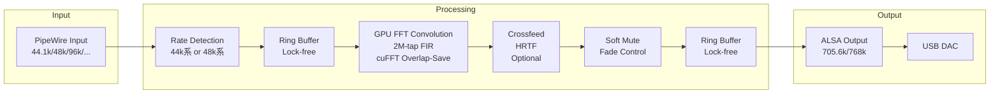

# Magic Box Project - 魔法の箱

**全てのヘッドホンユーザーに最高の音を届ける箱**

## ビジョン

**究極のシンプルさ**:
1. 箱をつなぐ
2. 管理画面でポチポチ
3. 最高の音

ユーザーに余計なことを考えさせない。ヘッドホンを選んで、ボタンを押すだけ。

## 何ができるか

- **究極のアップサンプリング**: 2,000,000タップ最小位相FIRフィルタ（44.1k系: 197dB / 48k系: 191dB ストップバンド減衰）
- **ヘッドホン補正EQ**: OPRAプロジェクト（CC BY-SA 4.0）のEQデータを活用し、あなたのヘッドホンをターゲットカーブ（KB5000_7）に自動補正
- **Auto-Negotiation**: DAC性能を自動検出し、最適なアップサンプリング倍率を自動算出
- **Multi-Rate対応**: 44.1kHz系/48kHz系を自動判定し、適切な係数に切り替え
- **Crossfeed (HRTF)**: オプションでヘッドホンのステレオ感を自然な音場に補正
- **Soft Mute**: レート切り替え時のフェード制御でポップノイズを防止

---

## システムアーキテクチャ

### 全体構成

```
┌─────────────────────────────────────────────────────────────────┐
│                    Control Plane (Python/FastAPI)               │
│  ┌──────────┐  ┌──────────────┐  ┌────────────────────────────┐ │
│  │  Web UI  │  │ IR Generator │  │      Orchestrator          │ │
│  │ (React)  │  │   (scipy)    │  │ (ZeroMQ Client)            │ │
│  └────┬─────┘  └──────────────┘  └─────────────┬──────────────┘ │
│       │                                        │                │
│       └────────────── REST/WS ─────────────────┘                │
│                         │                                       │
└─────────────────────────┼───────────────────────────────────────┘
                          │ ZeroMQ IPC (REQ/REP + PUB/SUB)
                          ▼
┌─────────────────────────────────────────────────────────────────┐
│                    Data Plane (C++ Audio Engine)                │
│  ┌──────────────────────────────────────────────────────────┐   │
│  │                   Audio Processing Pipeline               │   │
│  │  PipeWire → Rate Detection → GPU FFT → Crossfeed → ALSA  │   │
│  └──────────────────────────────────────────────────────────┘   │
│  ┌────────────┐ ┌─────────────┐ ┌───────────┐ ┌─────────────┐  │
│  │ Auto-Nego  │ │  Soft Mute  │ │ ZeroMQ Srv│ │ DAC Detect  │  │
│  └────────────┘ └─────────────┘ └───────────┘ └─────────────┘  │
└─────────────────────────────────────────────────────────────────┘
```

### オーディオ処理パイプライン



### ZeroMQ通信フロー


### RTPセッション管理

Jetson環境では PipeWire を介さずにネットワークRTPストリームを直接 Data Plane に流せます。
`config.json` の `rtp` セクション、もしくは ZeroMQ コマンドで制御します。

- `RTP_START_SESSION` / `RTP_STOP_SESSION` でセッションの開始・停止
- `RTP_LIST_SESSIONS` で受信メトリクス (パケット数、SSRC、PTP状態など) を取得
- PCM16/24/32 Big/Little Endian に対応し、自動で `float` へ変換して GPU パイプラインへ投入
- PTP Hook によるオフセット監視・Watchdog により SSRC 変更やギャップを検知

詳細は `docs/architecture/rtp_session_manager.md` を参照してください。

#### Control Plane (FastAPI) からの制御

FastAPI 側に `/api/rtp/sessions` エンドポイントを追加しました。GUI なしでも以下の手順でセッションを作成／監視できます。

```bash
uv sync
uv run uvicorn web.main:app --reload --port 8000

# セッション作成
curl -X POST http://127.0.0.1:8000/api/rtp/sessions \
  -H "Content-Type: application/json" \
  -d '{
    "session_id": "aes67-main",
    "endpoint": {"bind_address": "0.0.0.0", "port": 6000},
    "format": {"sample_rate": 48000, "channels": 2, "bits_per_sample": 24},
    "sync": {"target_latency_ms": 5}
  }'

# 状態確認
curl http://127.0.0.1:8000/api/rtp/sessions/aes67-main

# 停止
curl -X DELETE http://127.0.0.1:8000/api/rtp/sessions/aes67-main
```

`GET /api/rtp/sessions` はバックグラウンドポーラがキャッシュした RTCP テレメトリを返し、Data Plane に負荷を掛けません。

#### Web UI からの操作 (Issue #360)

FastAPI アプリを立ち上げると `/rtp` パスに **RTPセッション管理ページ** が追加されます。フォームから

1. セッションID / IP / ポート / ソースIPフィルタ
2. 同期モード（低遅延 / 安定 / PTP）
3. 任意のSDP貼り付け、SRTPキー（Base64 40文字以上）

を入力して送信すると `POST /api/rtp/sessions` が呼ばれ、結果はトースト通知で表示されます。  
下段には `GET /api/rtp/sessions` のキャッシュがカード表示され、接続状態・RTCP遅延・ジッタ統計・PTPロック可否を即時確認できます。各カードの「停止」ボタンは `DELETE /api/rtp/sessions/{id}` を呼び出します。

> ブラウザだけで「登録→開始→停止」まで完結するため、非エンジニアでもストリーム切り替えを担当できます。

---

## 主要機能

### Auto-Negotiation（自動調停）

DAC性能と入力レートから最適な出力レートを自動算出します。

```
┌─────────────────────────────────────────────────────────────┐
│                    Auto-Negotiation Flow                     │
├─────────────────────────────────────────────────────────────┤
│  1. DAC Capability Scan                                      │
│     └─ ALSA経由で最大サンプリングレート取得 (例: 768kHz)      │
│                                                              │
│  2. Input Rate Detection                                     │
│     └─ 44.1k系: 44100, 88200, 176400 Hz                     │
│     └─ 48k系:   48000, 96000, 192000 Hz                     │
│                                                              │
│  3. Optimal Rate Calculation                                 │
│     └─ target = max(input × N) where input × N ≤ dac_max    │
│     └─ 例: 44100 × 16 = 705600 ≤ 768000 ✓                   │
│                                                              │
│  4. IR Selection                                             │
│     └─ 44.1k系 → filter_44k_2m_minimum.bin                  │
│     └─ 48k系   → filter_48k_2m_minimum.bin                  │
└─────────────────────────────────────────────────────────────┘
```

| 入力レート | DAC Max | 出力レート | 倍率 | 係数セット |
|-----------|---------|-----------|------|-----------|
| 44.1kHz | 768kHz | 705.6kHz | 16x | 44k系 |
| 48kHz | 768kHz | 768kHz | 16x | 48k系 |
| 96kHz | 768kHz | 768kHz | 8x | 48k系 |
| 192kHz | 768kHz | 768kHz | 4x | 48k系 |

### Soft Mute（グリッチ防止）

レート切り替え時のポップノイズを防止するフェード制御機能です。

```
同族内切り替え (44.1k → 88.2k): グリッチレス（即座）
クロス族切り替え (44.1k → 48k):  Soft Mute適用（~50ms fade）
```

### Crossfeed (HRTF)

オプション機能。ヘッドホンの過度なステレオ分離を補正し、より自然なスピーカーライクな音場を実現します。

- 4つの頭サイズ（S, M, L, XL）に対応
- HRTFベースの畳み込み処理
- グリッチレス切り替え（ダブルバッファリング）

---

## 動作環境

### 開発環境（PC）

| 項目 | 仕様 |
|-----|-----|
| GPU | NVIDIA RTX 2070 Super (8GB VRAM) 以上 |
| CUDA | SM 7.5 (Turing) |
| OS | Linux (Ubuntu 22.04+) |
| オーディオ | PipeWire |

### 本番環境（Magic Box）

| 項目 | 仕様 |
|-----|-----|
| ハードウェア | NVIDIA Jetson Orin Nano Super (8GB, 1024 CUDA Cores) |
| CUDA | SM 8.7 (Ampere) |
| ストレージ | 1TB NVMe SSD (KIOXIA EXCERIA G2) |
| 入力 | USB Type-C (UAC2 Device Mode) - PCからはUSBオーディオデバイスとして認識 |
| 出力 | USB Type-A → 外部USB DAC |
| 管理 | Wi-Fi / Ethernet 経由のWeb UI |

---

## パフォーマンス

| メトリクス | 目標 | 実績 (RTX 2070S) |
|-----------|------|-----------------|
| Realtime Factor | > 1x | **~28x** |
| GPU Utilization | < 50% | **~15%** |
| Latency | < 100ms | **~50ms** |
| XRUN Rate | 0 | **0** (安定) |
| Stopband Attenuation | ~197dB | **197dB** |

---

## クイックスタート（PC開発環境）

### 1. フィルタ係数生成

```bash
# 環境セットアップ
uv sync

# 44.1k系 2M-tap 最小位相フィルタ生成
uv run python scripts/generate_filter.py --taps 2000000 --kaiser-beta 55

# 全構成（44k/48k × 2x/4x/8x/16x）一括生成（マルチレート対応）
uv run python scripts/generate_filter.py --generate-all --phase-type minimum

# 生成されるフィルタ:
# - filter_44k_16x_2m_min_phase.bin (44.1kHz → 705.6kHz)
# - filter_44k_8x_2m_min_phase.bin  (88.2kHz → 705.6kHz)
# - filter_44k_4x_2m_min_phase.bin  (176.4kHz → 705.6kHz)
# - filter_44k_2x_2m_min_phase.bin  (352.8kHz → 705.6kHz)
# - filter_48k_16x_2m_min_phase.bin (48kHz → 768kHz)
# - filter_48k_8x_2m_min_phase.bin  (96kHz → 768kHz)
# - filter_48k_4x_2m_min_phase.bin  (192kHz → 768kHz)
# - filter_48k_2x_2m_min_phase.bin  (384kHz → 768kHz)
# 各フィルタには対応するメタデータJSON（DCゲイン・レート情報含む）が生成されます
```

### 2. ビルド

```bash
# PC用ビルド (SM 7.5)
cmake -B build -DCMAKE_BUILD_TYPE=Release
cmake --build build -j$(nproc)
```

### 3. テスト実行

```bash
# CPUテスト（GPU不要）
./build/cpu_tests
./build/zmq_tests
./build/auto_negotiation_tests
./build/soft_mute_tests

# GPUテスト（GPU必要）
./build/gpu_tests
./build/crossfeed_tests
```

### 4. デーモン起動

```bash
./scripts/daemon.sh start

# サウンド設定で出力デバイスを「GPU Upsampler」に選択
```

---

## 主要仕様

### フィルタ仕様

| 項目 | 仕様 |
|-----|-----|
| FIRフィルタ | 2,000,000タップ |
| 位相タイプ | 最小位相（デフォルト）/ 線形位相（オプション） |
| ストップバンド減衰 | 44.1k系: 197dB / 48k系: 191dB |
| ウィンドウ関数 | Kaiser (β=25, Float32 GPU実装に最適化) |
| DCゲイン | アップサンプリング倍率 × 0.99（全レートで音量統一） |
| メタデータ | 各フィルタに`.json`ファイル（DCゲイン、入力/出力レート、倍率を含む） |

### アップサンプリング仕様（マルチレート対応）

システムは入力レートとDAC性能に基づいて自動的に最適なアップサンプリング倍率を選択します。

| 入力レート | 出力レート | 倍率 | 使用フィルタ |
|-----------|----------|------|------------|
| 44.1kHz | 705.6kHz | 16x | filter_44k_16x_2m_min_phase.bin |
| 88.2kHz | 705.6kHz | 8x | filter_44k_8x_2m_min_phase.bin |
| 176.4kHz | 705.6kHz | 4x | filter_44k_4x_2m_min_phase.bin |
| 352.8kHz | 705.6kHz | 2x | filter_44k_2x_2m_min_phase.bin |
| 48kHz | 768kHz | 16x | filter_48k_16x_2m_min_phase.bin |
| 96kHz | 768kHz | 8x | filter_48k_8x_2m_min_phase.bin |
| 192kHz | 768kHz | 4x | filter_48k_4x_2m_min_phase.bin |
| 384kHz | 768kHz | 2x | filter_48k_2x_2m_min_phase.bin |

**フィルタ配布**: 各レート・倍率に対応するフィルタ係数ファイル（`.bin`）とメタデータ（`.json`）が`data/coefficients/`に配置されています。メタデータにはDCゲイン、入力/出力レート、アップサンプリング倍率が記載されています。

**ゲイン設定**: `config.json`の`gain`パラメータはデフォルトで`1.0`に設定されており、全レートで適切に動作します。フィルタ係数は各レートで正規化されているため、追加のゲイン調整は通常不要です。

**ヘッドルーム設定**: `headroomTarget`（デフォルト`0.92`）は出力リミッターのターゲットピークを線形値で指定します。サンプリングレートや使用フィルタに依存せず一定音量を維持しつつ、ピークを0dBFS未満に抑えてクリッピングを防ぎます。0.5–0.999の範囲で設定可能です。

### EQ仕様

| 項目 | 仕様 |
|-----|-----|
| ターゲットカーブ | KB5000_7 |
| EQソース | OPRA Project (CC BY-SA 4.0) |
| 追加フィルタ | PK Fc 5366 Hz Gain 2.8 dB Q 1.5 |

### 低遅延パーティションモード

`config.json` の `partitionedConvolution` セクションで GPU パーティション処理を制御できます。  
サポートされるキー:

| キー | 説明 | デフォルト |
|------|------|------------|
| `enabled` | 低遅延モードの有効/無効 | `false` |
| `fastPartitionTaps` | 即時出力用パーティションのタップ数 | `32768` |
| `minPartitionTaps` | tail パーティションの最小タップ数 | `32768` |
| `maxPartitions` | 生成する最大パーティション数 | `4` |
| `tailFftMultiple` | tail パーティション FFT サイズをタップ数の何倍にするか（2〜16） | `2` |

```
"partitionedConvolution": {
  "enabled": true,
  "fastPartitionTaps": 32768,
  "minPartitionTaps": 32768,
  "maxPartitions": 4,
  "tailFftMultiple": 4
}
```

クロスフィードと EQ は現在の低遅延パスでは未サポートです。設定が衝突する場合はデーモン起動時にログへ警告が出力され、自動的に従来モードへフォールバックします。

---

## Web API

主要エンドポイント一覧（詳細は [docs/api/README.md](docs/api/README.md) 参照）

| エンドポイント | メソッド | 説明 |
|--------------|--------|------|
| `/api/status` | GET | システムステータス取得 |
| `/api/daemon/start` | POST | デーモン起動 |
| `/api/daemon/stop` | POST | デーモン停止 |
| `/api/eq/profiles` | GET | EQプロファイル一覧 |
| `/api/eq/apply` | POST | EQ適用 |
| `/api/opra/search` | GET | OPRAヘッドホン検索 |
| `/api/dac/capability/{id}` | GET | DAC性能取得 |

### ZeroMQコマンド

| コマンド | 説明 |
|---------|------|
| `LOAD_IR` | IR係数ロード |
| `SET_GAIN` | ゲイン設定 |
| `SOFT_RESET` | バッファクリア |
| `GET_STATUS` | ステータス取得 |
| `SWITCH_RATE` | レートファミリー切り替え |
| `APPLY_EQ` | EQ適用 |
| `RESTORE_EQ` | EQ解除 |

---

## プロジェクト構成

```
gpu_os/
├── README.md              # このファイル
├── CLAUDE.md              # AI開発ガイド（詳細仕様）
├── CMakeLists.txt         # C++/CUDAビルド設定
├── config.json            # ランタイム設定
├── pyproject.toml         # Python依存関係
│
├── src/                   # C++/CUDAソースコード
│   ├── gpu/               # GPU処理（convolution, crossfeed）
│   ├── zeromq_interface.cpp
│   ├── auto_negotiation.cpp
│   ├── soft_mute.cpp
│   └── ...
│
├── include/               # C++ヘッダー
├── web/                   # Python/FastAPI Web API
│   ├── main.py
│   ├── models.py
│   └── routers/
│
├── scripts/               # ユーティリティスクリプト
│   ├── generate_filter.py # フィルタ係数生成
│   └── daemon.sh          # デーモン管理
│
├── data/
│   ├── coefficients/      # FIRフィルタ係数
│   └── hrtf/              # HRTF係数（Crossfeed用）
│
├── docs/                  # ドキュメント
│   ├── api/               # REST API仕様
│   ├── architecture/      # システム設計
│   └── roadmap.md         # 開発ロードマップ
│
└── tests/                 # テストコード
    ├── cpp/               # C++ユニットテスト
    └── gpu/               # GPUテスト
```

---

## 開発ロードマップ

| Phase | 内容 | 進捗 |
|-------|-----|------|
| **1** | Core Engine & Middleware | **60%** |
| | - GPU FFT Convolution | ✅ 完了 (~28x realtime) |
| | - ZeroMQ通信層 | ✅ 完了 |
| | - Auto-Negotiation | ✅ 完了 |
| | - Soft Mute | ✅ 完了 |
| | - Crossfeed (HRTF) | ✅ 完了 |
| | - 48k系係数生成 | ⬜ 未実装 |
| | - 動的レート検知 | ⬜ 未実装 |
| **2** | Control Plane & Web UI | **20%** |
| | - FastAPI基本構造 | ✅ 完了 |
| | - OPRA統合 | ⬜ 未実装 |
| | - Webフロントエンド | ⬜ 未実装 |
| **3** | Hardware Integration | **0%** |
| | - Jetson移植 | ⬜ 未実装 |
| | - USB Gadget Mode | ⬜ 未実装 |

詳細は [docs/roadmap.md](docs/roadmap.md) を参照。

---

## ドキュメント

- [セットアップガイド](docs/setup/pc_development.md) - PC開発環境構築
- [アーキテクチャ概要](docs/architecture/overview.md) - システム設計詳細
- [REST API仕様](docs/api/README.md) - Web APIドキュメント
- [ロードマップ](docs/roadmap.md) - 開発計画と進捗

---

## ライセンス

TBD

### 使用ライブラリ

| ライブラリ | 用途 | ライセンス |
|-----------|------|----------|
| CUDA/cuFFT | GPU計算 | NVIDIA EULA |
| libpipewire | オーディオ入力 | MIT |
| alsa-lib | オーディオ出力 | LGPL-2.1 |
| ZeroMQ | IPC通信 | LGPL-3.0 |
| FastAPI | Web API | MIT |
| scipy | フィルタ生成 | BSD-3-Clause |

### EQデータソース

| ソース | ライセンス | 商用利用 |
|--------|----------|----------|
| **OPRA** | CC BY-SA 4.0 | ✅ OK（帰属表示必須） |
| oratory1990 | 独自 | ❌ 禁止 |

### HRTFデータソース（Crossfeed機能）

| ソース | ライセンス | 商用利用 |
|--------|----------|----------|
| **HUTUBS** | CC BY 4.0 | ✅ OK（帰属表示必須） |

**HUTUBS (Head-related Transfer Function Database of TU Berlin)**
- 提供元: Technische Universität Berlin
- URL: https://depositonce.tu-berlin.de/items/dc2a3076-a291-417e-97f0-7697e332c960
- 著者: Brinkmann, Dinakaran, Pelzer, Wohlgemuth, Seipel, Voss, Grosche, Weinzierl
- 帰属表示例: "HRTF data from HUTUBS database, TU Berlin (CC BY 4.0)"
