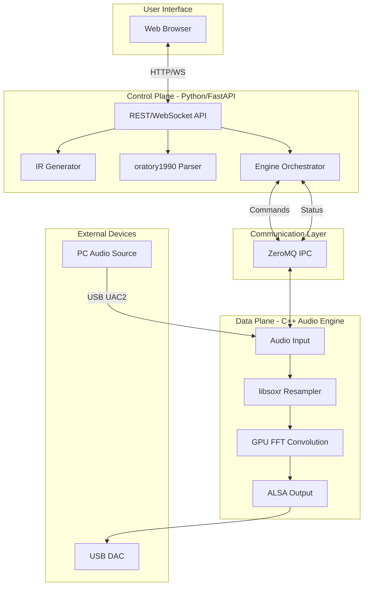

# Magic Box Project - Architecture Overview

## System Design Philosophy

**Ultimate Simplicity for Users:**
- 箱をつなぐ → 管理画面でポチポチ → 最高の音
- 複雑な処理はすべてシステム内部で自動化

**Separation of Concerns:**
- Control Plane: ユーザーインターフェース、数値計算
- Data Plane: 低遅延リアルタイム処理

## High-Level Architecture



## Control Plane (Python/FastAPI)

システムの頭脳。ユーザー操作と数値計算を担当。

### Components

#### 1. REST/WebSocket API
- **Purpose:** Web UIとの通信
- **Endpoints:**
  - `GET /api/headphones` - ヘッドホン一覧
  - `POST /api/headphones/{id}/apply` - EQ適用
  - `GET /api/status` - システムステータス
  - `WS /api/ws` - リアルタイムステータス

#### 2. IR Generator
- **Purpose:** FIR係数生成
- **Input:** oratory1990 EQパラメータ + ターゲットカーブ
- **Output:** 最小位相FIR係数（44.1k系/48k系の2種類）
- **Library:** scipy.signal

#### 3. oratory1990 Parser
- **Purpose:** AutoEQデータベースの解析
- **Data Source:** https://github.com/jaakkopasanen/AutoEq
- **Output:** ヘッドホンごとのEQパラメータ

#### 4. Engine Orchestrator
- **Purpose:** Data Planeの制御
- **Commands via ZeroMQ:**
  - `LOAD_IR <path>` - 係数ロード
  - `SET_GAIN <db>` - ゲイン設定
  - `SOFT_RESET` - ソフトリセット
  - `GET_STATUS` - ステータス取得

### Target Curve: KB5000_7

最新の研究に基づくターゲットカーブ。

**Base:** oratory1990 AutoEQ measurements
**Additional Filter:** `Filter 11: ON PK Fc 5366 Hz Gain 2.8 dB Q 1.5`

## Data Plane (C++ Audio Engine)

システムの心臓。低遅延・高負荷処理を担当。

### Components

#### 1. Audio Input (PipeWire/UAC2)
- **PC Mode:** PipeWire Source経由
- **Standalone Mode:** USB UAC2 Device Mode
- **Rate Detection:** 入力サンプルレート自動検知

#### 2. Resampler (libsoxr)
- **Purpose:** 可変レートリサンプリング
- **Quality:** Very High Quality preset
- **Flow:** 入力レート → DAC最大レート

#### 3. GPU FFT Convolution (CUDA/cuFFT)
- **Algorithm:** Overlap-Save方式
- **Filter:** 2M-tap minimum phase FIR
- **Performance:** ~28x realtime (RTX 2070S)

#### 4. ALSA Output
- **Purpose:** USB DAC直接出力
- **Format:** S32_LE (32-bit signed integer)
- **Feature:** Bit-perfect転送

### Data Flow

```
Input (44.1k/48k/96k/etc.)
    │
    ▼
┌─────────────────────┐
│  Rate Detection     │ ← 入力レート判定
└─────────────────────┘
    │
    ▼
┌─────────────────────┐
│  libsoxr Resample   │ ← DAC最大レートへ変換
└─────────────────────┘
    │
    ▼
┌─────────────────────┐
│  Ring Buffer        │ ← GPU転送待ち
└─────────────────────┘
    │
    ▼
┌─────────────────────┐
│  GPU FFT (cuFFT)    │ ← 2M-tap FIR畳み込み
│  Overlap-Save       │
└─────────────────────┘
    │
    ▼
┌─────────────────────┐
│  ALSA Output        │ ← USB DAC
└─────────────────────┘
    │
    ▼
Output (705.6k/768k)
```

## Communication Layer (ZeroMQ)

Control PlaneとData Planeを疎結合で接続。

### Message Format

```json
// Command (Control → Data)
{
  "cmd": "LOAD_IR",
  "params": {
    "path": "/data/coefficients/filter_44k_2m.bin",
    "rate_family": "44k"
  }
}

// Response (Data → Control)
{
  "status": "ok",
  "data": {
    "loaded": true,
    "tap_count": 2000000
  }
}

// Status Update (Data → Control)
{
  "type": "status",
  "data": {
    "input_rate": 44100,
    "output_rate": 705600,
    "gpu_load": 15.2,
    "buffer_level": 0.85
  }
}
```

## Auto-Negotiation System

ユーザーに意識させない自動最適化。

### Algorithm

```
1. DAC Capability Scan
   ├── ALSA経由で最大サンプルレート取得
   └── 例: 768000 Hz

2. Input Rate Detection
   ├── 44.1k系: 44100, 88200, 176400
   └── 48k系: 48000, 96000, 192000

3. Optimal Rate Calculation
   ├── target = max(input × N) where input × N ≤ dac_max
   └── 例: 44100 × 16 = 705600 ≤ 768000 ✓

4. IR Selection
   ├── 44.1k系 → filter_44k_2m.bin
   └── 48k系 → filter_48k_2m.bin
```

### Example Scenarios

| Input | DAC Max | Target | Ratio |
|-------|---------|--------|-------|
| 44.1k | 768k | 705.6k | 16x |
| 48k | 768k | 768k | 16x |
| 96k | 768k | 768k | 8x |
| 192k | 768k | 768k | 4x |
| 44.1k | 384k | 352.8k | 8x |

## Safety Mechanisms

### Soft Mute
- **Trigger:** レート切り替え時
- **Action:** Fade-out (50ms) → 切り替え → Fade-in (50ms)
- **Purpose:** ポップノイズ防止

### Dynamic Fallback
- **Trigger:** GPU負荷 > 80% または XRUN検出
- **Action:** タップ数削減 or レートダウン
- **Recovery:** 負荷低下時に自動復帰

### Hot-swap IR Loading
- **Method:** ダブルバッファリング（ピンポン）
- **Benefit:** グリッチなしで係数切り替え

## Hardware Configurations

### Development (PC)

```
PC Application
    │
    ▼
PipeWire
    │
    ▼
┌───────────────────────────┐
│  gpu_upsampler_alsa       │
│  ├── PipeWire Input       │
│  ├── RTX 2070S (cuFFT)    │
│  └── ALSA Output          │
└───────────────────────────┘
    │
    ▼
USB DAC
```

### Production (Magic Box)

```
PC
    │
    ▼ USB Type-C (UAC2)
┌───────────────────────────┐
│  Jetson Orin Nano Super   │
│  ├── USB Gadget Input     │
│  ├── Orin GPU (cuFFT)     │
│  └── ALSA Output          │
└───────────────────────────┘
    │
    ▼ USB Type-A
External USB DAC
```

## Performance Targets

| Metric | Target | Achieved (RTX 2070S) |
|--------|--------|----------------------|
| Realtime Factor | > 1x | ~28x |
| GPU Utilization | < 50% | ~15% |
| Latency | < 100ms | ~50ms |
| XRUN Rate | 0 | 0 (stable) |

## Memory Layout

### GPU Memory (VRAM)

| Buffer | Size | Purpose |
|--------|------|---------|
| Filter Coefficients | 8 MB | 2M × float32 |
| FFT Working | ~100 MB | cuFFT workspace |
| Input Buffer | 32 KB | Stereo input block |
| Output Buffer | 512 KB | Upsampled output |
| **Total** | **~120 MB** | |

### CPU Memory (RAM)

| Buffer | Size | Purpose |
|--------|------|---------|
| Ring Buffer (In) | 1 MB | PipeWire → GPU |
| Ring Buffer (Out) | 16 MB | GPU → ALSA |
| **Total** | **~17 MB** | |
