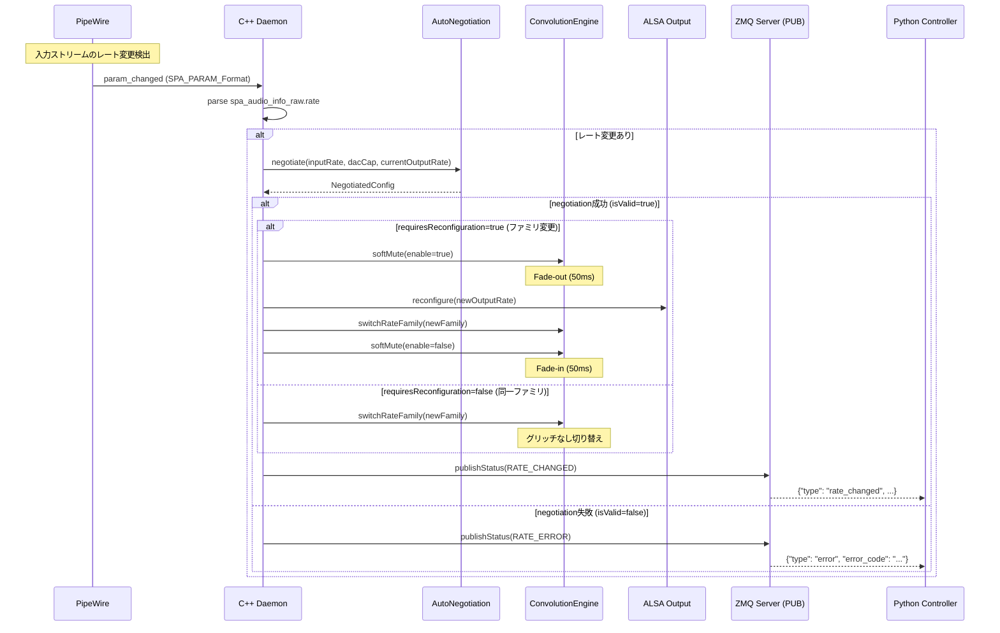
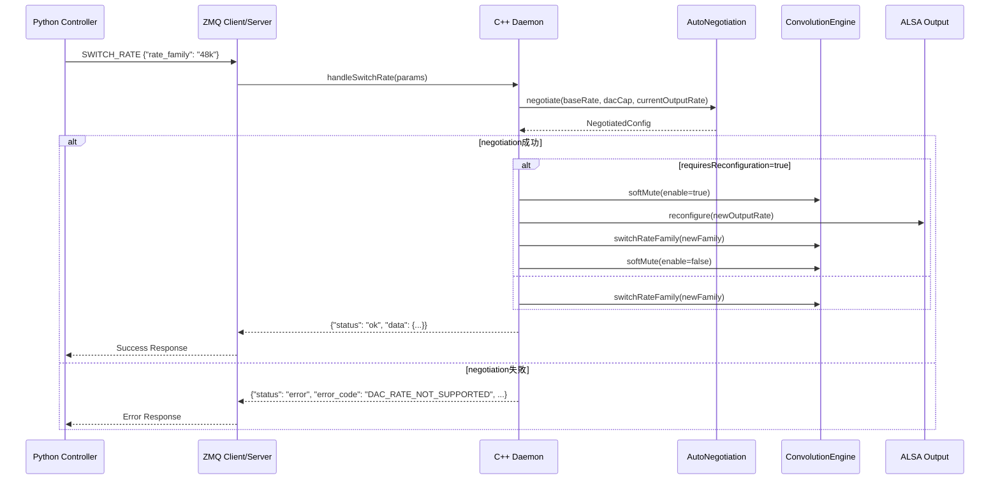

# Rate Negotiation Handshake Design

> **Related Issues:**
> - EPIC: [#37 レート自動交渉](https://github.com/michihitoTakami/michy_os/issues/37)
> - Task: [#218 入力サンプルレート検出とハンドシェイク](https://github.com/michihitoTakami/michy_os/issues/218)
> - Follow-up: [#231 GPUUpsampler Multi-Rate拡張](https://github.com/michihitoTakami/michy_os/issues/231)

## 1. 概要

本ドキュメントは、入力サンプルレートの動的検出とレート切り替えハンドシェイクの設計を定義する。

### 1.1 目的

- PipeWire/ALSA入力のサンプルレートを検出し、44.1k/48kファミリと2/4/8/16倍から最適な出力レートを決定
- ZMQコマンド/内部APIでレート切替要求を伝搬（成功/失敗の応答含む）
- レート変更時のバッファサイズ/period調整

### 1.2 サポートレート

| 入力レート | ファミリ | 出力レート候補 (16x/8x/4x/2x) |
|-----------|---------|------------------------------|
| 44100 Hz | 44.1k | 705600 / 352800 / 176400 / 88200 |
| 88200 Hz | 44.1k | 705600 / 352800 / 176400 |
| 176400 Hz | 44.1k | 705600 / 352800 |
| 48000 Hz | 48k | 768000 / 384000 / 192000 / 96000 |
| 96000 Hz | 48k | 768000 / 384000 / 192000 |
| 192000 Hz | 48k | 768000 / 384000 |

## 2. シーケンス図

### 2.1 PipeWireによる入力レート検出フロー



### 2.2 ZMQコマンドによるレート切り替えフロー



## 3. ZMQ API仕様

### 3.1 SWITCH_RATE コマンド

**Request:**
```json
{
  "cmd": "SWITCH_RATE",
  "params": {
    "rate_family": "44k" | "48k",
    "input_rate": 44100 | 48000 | 88200 | 96000 | 176400 | 192000  // optional
  }
}
```

**Success Response:**
```json
{
  "status": "ok",
  "message": "Rate switched to 48k family",
  "data": {
    "input_rate": 48000,
    "output_rate": 768000,
    "upsample_ratio": 16,
    "rate_family": "48k",
    "reconfigured": true
  }
}
```

**Error Response:**
```json
{
  "status": "error",
  "error_code": "DAC_RATE_NOT_SUPPORTED",
  "message": "DAC does not support 768000 Hz",
  "inner_error": {
    "cpp_code": "0x2004",
    "cpp_message": "Rate 768000 not in DAC supported rates",
    "alsa_errno": -22,
    "alsa_func": "snd_pcm_hw_params_set_rate_near"
  }
}
```

### 3.2 RATE_CHANGED PUB通知

入力レートが変更された場合、PUB/SUBチャネルで通知。

```json
{
  "type": "rate_changed",
  "timestamp": 1700000000000,
  "data": {
    "previous_input_rate": 44100,
    "previous_output_rate": 705600,
    "new_input_rate": 48000,
    "new_output_rate": 768000,
    "upsample_ratio": 16,
    "rate_family": "48k",
    "reconfigured": true
  }
}
```

### 3.3 エラーコード

| ErrorCode | 値 | 説明 |
|-----------|-----|------|
| `AUDIO_INVALID_INPUT_RATE` | 0x1001 | サポートされていない入力レート |
| `DAC_RATE_NOT_SUPPORTED` | 0x2004 | DACが出力レートをサポートしていない |
| `GPU_FILTER_LOAD_FAILED` | 0x4005 | 係数ファイルのロード失敗 |

## 4. 内部API仕様

### 4.1 AutoNegotiation::negotiate()

**既存実装** (`include/auto_negotiation.h`):
```cpp
namespace AutoNegotiation {
    NegotiatedConfig negotiate(int inputRate,
                               const DacCapability::Capability& dacCap,
                               int currentOutputRate = 0);
}
```

**NegotiatedConfig構造体:**
```cpp
struct NegotiatedConfig {
    int inputRate;                              // 入力サンプルレート
    ConvolutionEngine::RateFamily inputFamily;  // RATE_44K or RATE_48K
    int outputRate;                             // ネゴシエート済み出力レート
    int upsampleRatio;                          // アップサンプル比率
    bool isValid;                               // 成功フラグ
    bool requiresReconfiguration;               // ALSA再構成が必要か
    std::string errorMessage;                   // エラーメッセージ
};
```

### 4.2 handle_rate_change()

**現在の状態:** `on_param_changed()` イベントから接続済み

**接続先:**
1. PipeWire `param_changed` イベント
2. ZMQ `SWITCH_RATE` コマンドハンドラ

**実装予定:**
```cpp
// pipewire_daemon.cpp

// PipeWireイベントから呼び出される
static bool handle_rate_change(int detected_sample_rate) {
    if (!g_upsampler || !g_upsampler->isDualRateEnabled()) {
        return false;
    }

    auto dacCap = DacCapability::scan(g_alsa_device);
    auto config = AutoNegotiation::negotiate(
        detected_sample_rate, dacCap, g_current_output_rate.load());

    if (!config.isValid) {
        // PUB通知: エラー
        publishRateError(config.errorMessage);
        return false;
    }

    if (config.requiresReconfiguration) {
        // ファミリ変更: Soft Mute + ALSA再構成
        g_upsampler->softMute(true);
        reconfigureAlsa(config.outputRate);
    }

    // 係数切り替え
    g_upsampler->switchRateFamily(config.inputFamily);
    g_set_rate_family(config.inputFamily);
    g_current_input_rate.store(config.inputRate);
    g_current_output_rate.store(config.outputRate);

    if (config.requiresReconfiguration) {
        g_upsampler->softMute(false);
    }

    // PUB通知: 成功
    publishRateChanged(config);
    return true;
}
```

## 5. バッファ/Period調整

### 5.1 レート変更時の考慮事項

| パラメータ | 44.1k系 (705.6kHz出力) | 48k系 (768kHz出力) | 備考 |
|-----------|------------------------|-------------------|------|
| リングバッファ容量 | 768000 × 2 samples | 768000 × 2 samples | 両方対応のため最大値で統一 |
| ALSA period_size | 256-1024 | 256-1024 | DACに依存 |
| ALSA buffer_size | period × 4 | period × 4 | 安全マージン |

### 5.2 ALSA再構成手順

```cpp
bool reconfigureAlsa(int newRate) {
    // 1. 現在のストリームを停止
    snd_pcm_drop(pcm_handle);

    // 2. 新しいレートでhw_params設定
    snd_pcm_hw_params_t* hw_params;
    snd_pcm_hw_params_alloca(&hw_params);
    snd_pcm_hw_params_any(pcm_handle, hw_params);

    // フォーマット設定 (S32_LE)
    snd_pcm_hw_params_set_format(pcm_handle, hw_params, SND_PCM_FORMAT_S32_LE);

    // レート設定
    unsigned int rate = newRate;
    int dir = 0;
    int err = snd_pcm_hw_params_set_rate_near(pcm_handle, hw_params, &rate, &dir);
    if (err < 0 || rate != newRate) {
        return false;  // DAC_RATE_NOT_SUPPORTED
    }

    // 適用
    snd_pcm_hw_params(pcm_handle, hw_params);

    // 3. ストリーム再開
    snd_pcm_prepare(pcm_handle);
    return true;
}
```

### 5.3 エラー時の挙動

| エラー | 原因 | 復旧アクション |
|--------|------|----------------|
| `DAC_RATE_NOT_SUPPORTED` | DACが新レートをサポートしない | 前のレートを維持、エラー通知 |
| `AUDIO_BUFFER_OVERFLOW` | バッファ調整失敗 | Soft Reset実行 |
| `AUDIO_XRUN_DETECTED` | アンダーラン発生 | バッファ再充填待ち |

## 6. PipeWire param_changed イベント

### 6.1 イベントハンドラ登録

```cpp
static const struct pw_stream_events input_stream_events = {
    .version = PW_VERSION_STREAM_EVENTS,
    .state_changed = on_stream_state_changed,
    .param_changed = on_param_changed,  // 追加
    .process = on_input_process,
};

static void on_param_changed(void* userdata, uint32_t id, const struct spa_pod* param) {
    if (id != SPA_PARAM_Format || param == nullptr) {
        return;
    }

    struct spa_audio_info_raw info;
    if (spa_format_audio_raw_parse(param, &info) < 0) {
        return;
    }

    int detected_rate = info.rate;
    if (detected_rate != g_current_input_rate.load()) {
        // 別スレッドで処理（リアルタイムスレッドをブロックしない）
        // または、フラグを立てて main loop で処理
        g_pending_rate_change.store(detected_rate);
    }
}
```

### 6.2 非リアルタイム処理

レート変更はALSA再構成を伴うため、オーディオコールバック内で直接実行しない。

```cpp
// Main loop内で処理
while (g_running) {
    int pending_rate = g_pending_rate_change.exchange(0);
    if (pending_rate > 0) {
        handle_rate_change(pending_rate);
    }

    // pw_loop_iterate を使用（pw_main_loop_runの代わり）
    pw_loop_iterate(pw_main_loop_get_loop(data.loop), 10);  // 10ms timeout
}
```

## 7. 現在の実装制限

### 7.1 Dual-Rate Mode vs Multi-Rate Mode

現在の実装は **Dual-Rate Mode** のみをサポートしており、以下の制限がある：

| モード | サポート入力レート | 制限事項 |
|--------|-------------------|----------|
| **Dual-Rate Mode** (現在) | 44100 Hz, 48000 Hz のみ | 88.2k/96k/176.4k/192k等の高レート入力は警告を出し、ベースレートとして処理 |
| **Multi-Rate Mode** (将来) | 44100/88200/176400, 48000/96000/192000 Hz | 各レートに対応した係数ファイルが必要 |

### 7.2 制限事項の詳細

1. **GPUUpsampler.switchRateFamily()** はベースレート（44.1k/48k）のみを設定
2. **非ベースレート入力時**: 正しいファミリに切り替えるが、アップサンプル比率は不正確
   - 例: 88.2kHz → 705.6kHz は実際には8xだが、44.1kHzとして処理されるため16x処理
3. **libsoxrリサンプラー**: 入力レートと出力レートを動的に変更する必要がある（未実装）

### 7.3 後続Issue

- **Issue #231**: GPUUpsampler Multi-Rate拡張
  - `initializeMultiRate()` による8構成係数ロード
  - `switchRateFamily()` の拡張（具体的入力レート対応）
  - libsoxrリサンプラーの動的レート変更

## 8. テスト計画

### 8.1 ユニットテスト

| テストケース | 入力 | 期待出力 |
|-------------|------|---------|
| 44.1kHz入力 → 705.6kHz出力 | `negotiate(44100, dacCap)` | `{outputRate: 705600, ratio: 16}` |
| 48kHz入力 → 768kHz出力 | `negotiate(48000, dacCap)` | `{outputRate: 768000, ratio: 16}` |
| 96kHz入力 → 768kHz出力 | `negotiate(96000, dacCap)` | `{outputRate: 768000, ratio: 8}` |
| 44.1k→48k切り替え | `negotiate(48000, ...)` (from 44.1k) | `{requiresReconfiguration: true}` |
| 同一ファミリ切り替え | `negotiate(88200, ...)` (from 44.1k) | `{requiresReconfiguration: false}` |
| 未サポートレート | `negotiate(22050, dacCap)` | `{isValid: false}` |
| DACレート不足 | `negotiate(44100, dacCap_max384k)` | `{outputRate: 352800}` |

### 8.2 統合テスト (手動)

1. **PipeWireレート検出:**
   - 44.1kHzソース再生 → ログで705.6kHz出力確認
   - 48kHzソースに切り替え → ログで768kHz出力確認

2. **ZMQコマンド:**
   - `SWITCH_RATE {"rate_family": "48k"}` 送信
   - 成功レスポンス確認
   - ステータスで`currentRateFamily: "48k"`確認

## 9. 実装チェックリスト

- [x] `on_param_changed()` イベントハンドラ追加
- [x] `g_pending_rate_change` atomic変数追加
- [x] `handle_rate_change()` の `[[maybe_unused]]` 削除、接続
- [x] `handle_rate_change()` を `AutoNegotiation::negotiate()` と統合
- [x] CMakeLists.txt に auto_negotiation, dac_capability リンク追加
- [x] 非ベースレート入力時の警告メッセージ追加 (Issue #231への参照)
- [ ] `SWITCH_RATE` ZMQコマンドハンドラ実装 (後続Issue)
- [ ] `publishRateChanged()` PUB通知実装 (後続Issue)
- [x] ユニットテスト追加 (`test_auto_negotiation.cpp`)
- [ ] 統合テスト実行
- [ ] Multi-Rate対応 (Issue #231)
