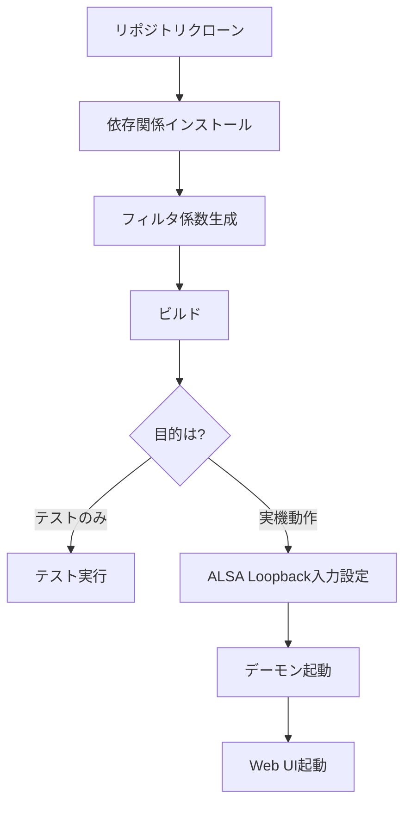

# セットアップガイド

Totton Audio Projectの開発環境構築とセットアップに関するドキュメント。

## ドキュメント一覧

| ドキュメント | 内容 | 対象者 |
|-------------|------|--------|
| [クイックスタート](quick_start.md) | 最小限の手順で動作確認 | 初めての方 |
| [ビルド手順](build.md) | 詳細なビルド手順・トラブルシューティング | 開発者 |
| [テスト実行](test.md) | テストの実行方法 | 開発者 |
| [PC開発環境](pc_development.md) | ALSA Loopback / RTP入力の詳細設定 | 開発者（実機動作） |
| [Web UI](web_ui.md) | Web UIサーバーの起動・設定 | 開発者 |
| [Raspberry Pi ブリッジ](pi_bridge.md) | PiをUAC2+RTPブリッジとして初期化 | Jetson + Pi構成 |

## 環境別ガイド

### PC開発環境（推奨）

```
┌─────────────────────────────────────────────────────────────────┐
│  PC開発環境 (Ubuntu 22.04+)                                      │
├─────────────────────────────────────────────────────────────────┤
│  GPU: RTX 2070 Super以上 (CUDA SM 7.5+)                         │
│  Audio: ALSA Loopback (RTP) → GPU Upsampler → ALSA → USB DAC       │
└─────────────────────────────────────────────────────────────────┘
```

1. [クイックスタート](quick_start.md) で環境構築
2. [ビルド手順](build.md) でビルド
3. [テスト実行](test.md) でテスト
4. [PC開発環境](pc_development.md) で実機動作確認

### Jetson Orin Nano（本番環境）

```
┌─────────────────────────────────────────────────────────────────┐
│  Jetson Orin Nano Super (Totton Audio Project)                             │
├─────────────────────────────────────────────────────────────────┤
│  SoC: Jetson Orin Nano Super (8GB, SM 8.7)                      │
│  Audio: USB Gadget (UAC2) → GPU Upsampler → USB DAC             │
└─────────────────────────────────────────────────────────────────┘
```

→ [docs/jetson/README.md](../jetson/README.md) を参照

## 必要なソフトウェア

### 必須

| ソフトウェア | バージョン | 用途 |
|-------------|----------|------|
| CUDA Toolkit | 12.0+ | GPU計算 |
| CMake | 3.20+ | ビルドシステム |
| GCC | 11+ | C++コンパイラ |
| Python | 3.11+ | スクリプト・Web API |
| uv | 最新 | Python依存管理 |

### オプション（実機動作時）

| ソフトウェア | バージョン | 用途 |
|-------------|----------|------|
| ALSA | - | オーディオ入出力 |
| ZeroMQ | 4.3+ | IPC通信 |

## セットアップの流れ



### Step 1: 依存関係

```bash
# Ubuntu/Debian
sudo apt update
sudo apt install -y build-essential cmake nvidia-cuda-toolkit \
    libasound2-dev libzmq3-dev

# Python (uv推奨)
curl -LsSf https://astral.sh/uv/install.sh | sh
uv sync
```

### Step 2: フィルタ係数生成

```bash
# 全構成（44k/48k × 2x/4x/8x/16x）最小位相フィルタ
uv run python scripts/filters/generate_minimum_phase.py --generate-all

# 全構成の線形位相フィルタ（100Hzクロスオーバ/約10ms整列）
uv run python scripts/filters/generate_linear_phase.py --generate-all
```

### Step 3: ビルド

```bash
cmake -B build -DCMAKE_BUILD_TYPE=Release
cmake --build build -j$(nproc)
```

### Step 4: テスト

```bash
./build/cpu_tests        # CPUテスト
./build/gpu_tests        # GPUテスト
```

詳細は各ドキュメントを参照してください。
