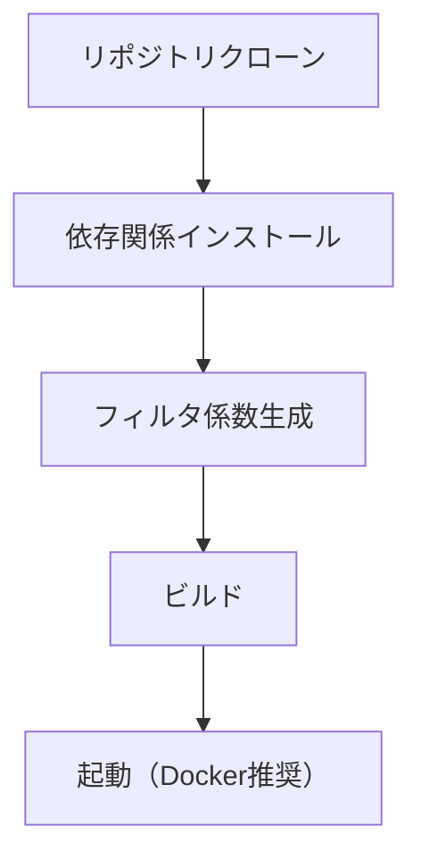

# セットアップガイド

Totton Audio Projectの開発環境構築とセットアップに関するドキュメント。

## ドキュメント一覧

| ドキュメント | 内容 | 対象者 |
|-------------|------|--------|
| [Docker](../../docker/README.md) | Dockerで起動（評価者/開発者） | まず動かしたい方 |
| [ビルド手順](build.md) | 詳細なビルド手順・トラブルシューティング | 開発者 |
| [Raspberry Pi ブリッジ](pi_bridge.md) | PiをUAC2+RTPブリッジとして初期化 | Jetson + Pi構成 |
| [De-Limiter](delimiter.md) | De-Limiter のセットアップ/運用 | Jetson + Pi構成 |

## 環境別ガイド

### Docker（推奨）

```
┌─────────────────────────────────────────────────────────────────┐
│  Docker (Jetson / Raspberry Pi)                                  │
├─────────────────────────────────────────────────────────────────┤
│  Jetson: GPU Upsampler + Web (Compose)                            │
│  Pi: UAC2受け口ブリッジ (Compose)                                 │
└─────────────────────────────────────────────────────────────────┘
```

1. [Docker（評価者向け / ソース不要）](../../docker/README.evaluator.md) で起動
2. [Docker（ローカルビルド / 開発者向け）](../../docker/README.local_build.md) で起動（必要な場合）
3. Raspberry Pi を使う場合は [Raspberry Pi ブリッジ](pi_bridge.md) と `raspberry_pi/README.md` を参照

### Jetson Orin Nano（Dockerで起動）

```
┌─────────────────────────────────────────────────────────────────┐
│  Jetson Orin Nano Super (Totton Audio Project)                             │
├─────────────────────────────────────────────────────────────────┤
│  SoC: Jetson Orin Nano Super (8GB, SM 8.7)                      │
│  Audio: USB Gadget (UAC2) → GPU Upsampler → USB DAC             │
└─────────────────────────────────────────────────────────────────┘
```

→ [Docker（評価者向け / ソース不要）](../../docker/README.evaluator.md) または [Docker（ローカルビルド / 開発者向け）](../../docker/README.local_build.md) を参照

## 必要なソフトウェア

### 必須

| ソフトウェア | バージョン | 用途 |
|-------------|----------|------|
| CUDA Toolkit | 12.0+ | GPU計算 |
| CMake | 3.20+ | ビルドシステム |
| GCC | 11+ | C++コンパイラ |
| Python | 3.11+ | スクリプト・Web API |
| uv | 最新 | Python依存管理 |

### オプション（実機動作時）

| ソフトウェア | バージョン | 用途 |
|-------------|----------|------|
| ALSA | - | オーディオ入出力 |
| ZeroMQ | 4.3+ | IPC通信 |

## セットアップの流れ



### Step 1: 依存関係（ソースからビルドする場合）

```bash
# Ubuntu/Debian
sudo apt update
sudo apt install -y build-essential cmake nvidia-cuda-toolkit \
    libasound2-dev libzmq3-dev

# Python (uv推奨)
curl -LsSf https://astral.sh/uv/install.sh | sh
uv sync
```

### Step 2: フィルタ係数生成（ソースからビルドする場合）

```bash
# 全構成（44k/48k × 2x/4x/8x/16x）最小位相フィルタ
uv run python scripts/filters/generate_minimum_phase.py --generate-all

# 全構成の線形位相フィルタ（100Hzクロスオーバ/約10ms整列）
uv run python scripts/filters/generate_linear_phase.py --generate-all
```

### Step 3: ビルド（ソースからビルドする場合）

```bash
cmake -B build -DCMAKE_BUILD_TYPE=Release
cmake --build build -j$(nproc)
```

詳細は各ドキュメントを参照してください。
